# Memory Assistant - Autonomous Agent Architecture
## Detailed Interaction Diagram and System Flow

---

## 🤖 **Agent Ecosystem Overview**

The Memory Assistant employs a sophisticated autonomous agent architecture where 6 specialized agents work in harmony under the coordination of a central orchestrator. Each agent has specific responsibilities while maintaining seamless communication and data sharing with others.

### **Core Design Principles:**
- **Autonomous Operation**: Each agent operates independently while coordinating with others
- **Event-Driven Architecture**: Agents respond to events and trigger actions in other agents
- **Data Flow Optimization**: Efficient data sharing without redundancy
- **Scalable Coordination**: Orchestrator manages complexity without bottlenecks
- **Fault Tolerance**: System continues operating even if individual agents fail

---

## 🏗️ **Complete Agent Architecture Diagram**

```mermaid
graph TB
    %% External Inputs
    User[👤 User Input] --> Orchestrator
    WebApp[📱 Web App] --> Orchestrator
    Schedule[⏰ Scheduled Tasks] --> Orchestrator
    
    %% Central Orchestrator
    Orchestrator[🎯 Memory System Orchestrator<br/>- Event Queue Management<br/>- Agent Coordination<br/>- Performance Monitoring<br/>- Learning Pipeline]
    
    %% Core Agents
    Harvester[🔍 Memory Harvester Agent<br/>- Data Collection<br/>- Content Normalization<br/>- Source Tracking<br/>- Quality Validation]
    
    Analyzer[📊 Pattern Analyzer Agent<br/>- Behavioral Analysis<br/>- Trend Detection<br/>- Communication Patterns<br/>- Decision Frameworks]
    
    Mapper[🗺️ Relationship Mapper Agent<br/>- Social Graph Building<br/>- Interaction Tracking<br/>- Connection Analysis<br/>- Influence Mapping]
    
    Trainer[🧠 Avatar Trainer Agent<br/>- AI Model Training<br/>- Personality Modeling<br/>- Response Generation<br/>- Continuous Learning]
    
    Guardian[🛡️ Privacy Guardian Agent<br/>- Access Control<br/>- Data Encryption<br/>- Compliance Monitoring<br/>- Audit Logging]
    
    Generator[💡 Insight Generator Agent<br/>- Pattern Synthesis<br/>- Recommendation Engine<br/>- Predictive Analytics<br/>- Wisdom Extraction]
    
    %% Data Stores
    MemoryDB[(🗄️ Memory Database<br/>- User Memories<br/>- Metadata<br/>- Classifications)]
    
    PatternDB[(📈 Pattern Database<br/>- Behavioral Data<br/>- Trends<br/>- Analytics)]
    
    RelationDB[(👥 Relationship Database<br/>- Social Graph<br/>- Interactions<br/>- Connections)]
    
    ModelStore[(🤖 Model Store<br/>- AI Models<br/>- Training Data<br/>- Checkpoints)]
    
    SecurityVault[(🔐 Security Vault<br/>- Encrypted Data<br/>- Access Logs<br/>- Permissions)]
    
    InsightCache[(💎 Insight Cache<br/>- Generated Insights<br/>- Recommendations<br/>- Predictions)]
    
    %% Agent Interactions - Primary Flow
    Orchestrator -->|1. New Memory Event| Harvester
    Harvester -->|2. Processed Memory| Analyzer
    Analyzer -->|3. Patterns + Memory| Mapper
    Mapper -->|4. Relationships + Patterns| Guardian
    Guardian -->|5. Filtered Data| Trainer
    Trainer -->|6. Updated Model| Generator
    Generator -->|7. Insights| Orchestrator
    
    %% Cross-Agent Communications
    Harvester -.->|Memory Quality Feedback| Generator
    Analyzer -.->|Pattern Updates| Trainer
    Mapper -.->|Relationship Context| Analyzer
    Guardian -.->|Security Constraints| Harvester
    Trainer -.->|Learning Feedback| Analyzer
    Generator -.->|Insight Validation| Guardian
    
    %% Bidirectional Data Access
    Harvester <--> MemoryDB
    Analyzer <--> PatternDB
    Mapper <--> RelationDB
    Trainer <--> ModelStore
    Guardian <--> SecurityVault
    Generator <--> InsightCache
    
    %% Cross-Database Access
    Analyzer -.-> MemoryDB
    Mapper -.-> MemoryDB
    Trainer -.-> PatternDB
    Trainer -.-> RelationDB
    Generator -.-> PatternDB
    Generator -.-> RelationDB
    Guardian -.-> MemoryDB
    Guardian -.-> PatternDB
    Guardian -.-> RelationDB
    
    %% Output Channels
    Orchestrator --> WebApp
    Orchestrator --> Notifications[📢 Notifications]
    Orchestrator --> Analytics[📊 Analytics Dashboard]
    Orchestrator --> BackgroundTasks[⚙️ Background Tasks]
    
    %% Styling
    classDef orchestrator fill:#ff6b6b,stroke:#333,stroke-width:3px,color:#fff
    classDef agent fill:#4ecdc4,stroke:#333,stroke-width:2px,color:#fff
    classDef database fill:#45b7d1,stroke:#333,stroke-width:2px,color:#fff
    classDef external fill:#96ceb4,stroke:#333,stroke-width:2px,color:#333
    classDef output fill:#feca57,stroke:#333,stroke-width:2px,color:#333
    
    class Orchestrator orchestrator
    class Harvester,Analyzer,Mapper,Trainer,Guardian,Generator agent
    class MemoryDB,PatternDB,RelationDB,ModelStore,SecurityVault,InsightCache database
    class User,WebApp,Schedule external
    class Notifications,Analytics,BackgroundTasks output
```



---

## 🔄 **Agent Interaction Flows**

### **1. Primary Memory Processing Flow**


### **2. Cross-Agent Communication Patterns**

#### **A. Feedback Loops**


#### **B. Security Integration**


### **3. Data Sharing Architecture**


---

## 🎯 **Individual Agent Specifications**

### **1. Memory Harvester Agent**

#### **Responsibilities:**
- **Data Collection**: Gather memories from multiple sources
- **Content Normalization**: Standardize format and structure
- **Quality Validation**: Ensure data integrity and completeness
- **Source Tracking**: Maintain provenance and context

#### **Interactions:**
```python
class MemoryHarvesterAgent:
    async def process_new_memory(self, user_id, content, metadata):
        # 1. Validate and normalize input
        normalized_memory = await self.normalize_content(content, metadata)
        
        # 2. Request classification from Pattern Analyzer
        classification_request = await self.send_to_analyzer(normalized_memory)
        
        # 3. Check security constraints with Privacy Guardian
        security_check = await self.check_with_guardian(normalized_memory)
        
        # 4. Store in memory database
        memory_id = await self.store_memory(normalized_memory)
        
        # 5. Notify other agents
        await self.notify_agents('new_memory', {
            'memory_id': memory_id,
            'user_id': user_id,
            'classification': classification_request,
            'security_level': security_check
        })
        
        return memory_id
```

#### **Data Outputs:**
- Normalized memory objects
- Quality metrics
- Source attribution
- Processing timestamps

### **2. Pattern Analyzer Agent**

#### **Responsibilities:**
- **Behavioral Analysis**: Identify user behavior patterns
- **Communication Style**: Analyze how user communicates
- **Decision Patterns**: Extract decision-making frameworks
- **Trend Detection**: Spot emerging patterns over time

#### **Interactions:**
```python
class PatternAnalyzerAgent:
    async def analyze_memory(self, memory_data):
        # 1. Extract behavioral patterns
        behavior_patterns = await self.extract_behavior_patterns(memory_data)
        
        # 2. Analyze communication style
        comm_style = await self.analyze_communication_style(memory_data)
        
        # 3. Update relationship context with Mapper
        relationship_context = await self.request_relationship_context(
            memory_data.participants
        )
        
        # 4. Send learning data to Avatar Trainer
        await self.send_learning_data(behavior_patterns, comm_style)
        
        # 5. Request insight generation
        await self.trigger_insight_generation(behavior_patterns)
        
        return {
            'patterns': behavior_patterns,
            'communication_style': comm_style,
            'confidence_score': self.calculate_confidence(behavior_patterns)
        }
```

#### **Data Outputs:**
- Behavioral pattern models
- Communication style profiles
- Decision-making frameworks
- Confidence scores

### **3. Relationship Mapper Agent**

#### **Responsibilities:**
- **Social Graph Building**: Construct relationship networks
- **Interaction Tracking**: Monitor relationship dynamics
- **Connection Analysis**: Identify relationship strengths
- **Influence Mapping**: Track influence patterns

#### **Interactions:**
```python
class RelationshipMapperAgent:
    async def update_from_memory(self, memory_data, patterns):
        # 1. Extract relationship information
        relationships = await self.extract_relationships(memory_data)
        
        # 2. Update social graph
        await self.update_social_graph(relationships, patterns)
        
        # 3. Analyze interaction patterns
        interaction_patterns = await self.analyze_interactions(relationships)
        
        # 4. Send context to Pattern Analyzer
        await self.send_relationship_context(interaction_patterns)
        
        # 5. Update Avatar Trainer with social context
        await self.send_social_context_to_trainer(relationships, interaction_patterns)
        
        # 6. Check privacy implications with Guardian
        await self.check_relationship_privacy(relationships)
        
        return {
            'updated_relationships': relationships,
            'interaction_patterns': interaction_patterns,
            'social_graph_changes': await self.get_graph_changes()
        }
```

#### **Data Outputs:**
- Social graph structures
- Relationship strength metrics
- Interaction frequency data
- Influence network maps

### **4. Avatar Trainer Agent**

#### **Responsibilities:**
- **AI Model Training**: Continuously train personalized AI
- **Personality Modeling**: Build authentic personality representation
- **Response Generation**: Generate contextual responses
- **Learning Integration**: Incorporate new learning data

#### **Interactions:**
```python
class AvatarTrainerAgent:
    async def incorporate_memory(self, filtered_data, patterns, relationships):
        # 1. Prepare training data
        training_data = await self.prepare_training_data(
            filtered_data, patterns, relationships
        )
        
        # 2. Update personality model
        personality_updates = await self.update_personality_model(patterns)
        
        # 3. Fine-tune response generation
        await self.fine_tune_responses(training_data)
        
        # 4. Validate model performance
        performance_metrics = await self.validate_model_performance()
        
        # 5. Send feedback to Pattern Analyzer
        await self.send_learning_feedback(performance_metrics)
        
        # 6. Update Insight Generator with new capabilities
        await self.notify_insight_generator(personality_updates)
        
        return {
            'model_updates': personality_updates,
            'performance_metrics': performance_metrics,
            'training_status': 'completed'
        }
```

#### **Data Outputs:**
- Trained AI models
- Personality profiles
- Response templates
- Performance metrics

### **5. Privacy Guardian Agent**

#### **Responsibilities:**
- **Access Control**: Manage data access permissions
- **Data Encryption**: Protect sensitive information
- **Compliance Monitoring**: Ensure privacy compliance
- **Audit Logging**: Track all security events

#### **Interactions:**
```python
class PrivacyGuardianAgent:
    async def filter_memory(self, memory_data, user_id):
        # 1. Classify sensitivity level
        sensitivity_level = await self.classify_sensitivity(memory_data)
        
        # 2. Apply access controls
        access_rules = await self.get_access_rules(user_id, sensitivity_level)
        
        # 3. Encrypt sensitive data
        encrypted_data = await self.encrypt_sensitive_content(memory_data)
        
        # 4. Log security event
        await self.log_security_event('memory_processed', {
            'user_id': user_id,
            'sensitivity_level': sensitivity_level,
            'access_rules_applied': access_rules
        })
        
        # 5. Notify other agents of constraints
        await self.notify_security_constraints(access_rules)
        
        return {
            'filtered_data': encrypted_data,
            'access_level': sensitivity_level,
            'security_metadata': access_rules
        }
```

#### **Data Outputs:**
- Filtered/encrypted data
- Access control rules
- Security classifications
- Audit logs

### **6. Insight Generator Agent**

#### **Responsibilities:**
- **Pattern Synthesis**: Combine patterns into insights
- **Recommendation Engine**: Generate actionable recommendations
- **Predictive Analytics**: Predict future needs and behaviors
- **Wisdom Extraction**: Extract meaningful life lessons

#### **Interactions:**
```python
class InsightGeneratorAgent:
    async def generate_from_memory(self, filtered_data, patterns, relationships):
        # 1. Synthesize patterns across domains
        synthesized_patterns = await self.synthesize_patterns(
            patterns, relationships
        )
        
        # 2. Generate insights
        insights = await self.generate_insights(synthesized_patterns)
        
        # 3. Validate insights with Privacy Guardian
        validated_insights = await self.validate_with_guardian(insights)
        
        # 4. Send feedback to Pattern Analyzer
        await self.send_pattern_feedback(insights, patterns)
        
        # 5. Update Avatar Trainer with insight capabilities
        await self.enhance_avatar_insights(validated_insights)
        
        # 6. Cache insights for quick access
        await self.cache_insights(validated_insights)
        
        return {
            'insights': validated_insights,
            'confidence_scores': await self.calculate_confidence(insights),
            'actionable_recommendations': await self.extract_actions(insights)
        }
```

#### **Data Outputs:**
- Generated insights
- Recommendations
- Predictions
- Confidence scores

---

## ⚡ **Event-Driven Coordination**

### **Event Types and Handlers**

```python
class EventTypes:
    # Memory Events
    NEW_MEMORY_ADDED = "new_memory_added"
    MEMORY_UPDATED = "memory_updated"
    MEMORY_DELETED = "memory_deleted"
    
    # Pattern Events
    PATTERN_DETECTED = "pattern_detected"
    BEHAVIOR_CHANGE = "behavior_change"
    TREND_IDENTIFIED = "trend_identified"
    
    # Relationship Events
    NEW_RELATIONSHIP = "new_relationship"
    RELATIONSHIP_UPDATED = "relationship_updated"
    SOCIAL_GRAPH_CHANGE = "social_graph_change"
    
    # AI Events
    MODEL_UPDATED = "model_updated"
    TRAINING_COMPLETED = "training_completed"
    PERFORMANCE_THRESHOLD = "performance_threshold"
    
    # Security Events
    SECURITY_VIOLATION = "security_violation"
    ACCESS_DENIED = "access_denied"
    ENCRYPTION_UPDATED = "encryption_updated"
    
    # Insight Events
    INSIGHT_GENERATED = "insight_generated"
    RECOMMENDATION_CREATED = "recommendation_created"
    PREDICTION_MADE = "prediction_made"

class EventHandlers:
    def __init__(self, agents):
        self.agents = agents
        self.handlers = {
            EventTypes.NEW_MEMORY_ADDED: self.handle_new_memory,
            EventTypes.PATTERN_DETECTED: self.handle_pattern_detection,
            EventTypes.RELATIONSHIP_UPDATED: self.handle_relationship_update,
            EventTypes.MODEL_UPDATED: self.handle_model_update,
            EventTypes.SECURITY_VIOLATION: self.handle_security_violation,
            EventTypes.INSIGHT_GENERATED: self.handle_insight_generation
        }
    
    async def handle_new_memory(self, event_data):
        # Coordinate all agents for new memory processing
        memory_id = event_data['memory_id']
        
        # 1. Harvester processes
        processed_memory = await self.agents['harvester'].process(memory_id)
        
        # 2. Analyzer extracts patterns
        patterns = await self.agents['analyzer'].analyze(processed_memory)
        
        # 3. Mapper updates relationships
        relationships = await self.agents['mapper'].update(processed_memory, patterns)
        
        # 4. Guardian applies security
        secured_data = await self.agents['guardian'].secure(processed_memory)
        
        # 5. Trainer updates model
        model_updates = await self.agents['trainer'].train(secured_data, patterns)
        
        # 6. Generator creates insights
        insights = await self.agents['generator'].generate(
            secured_data, patterns, relationships
        )
        
        return {
            'processed': True,
            'insights': insights,
            'model_updates': model_updates
        }
```

---

## 🔄 **Performance Optimization**

### **Agent Load Balancing**

```python
class AgentLoadBalancer:
    def __init__(self):
        self.agent_queues = {
            'harvester': asyncio.Queue(maxsize=100),
            'analyzer': asyncio.Queue(maxsize=50),
            'mapper': asyncio.Queue(maxsize=30),
            'trainer': asyncio.Queue(maxsize=20),
            'guardian': asyncio.Queue(maxsize=100),
            'generator': asyncio.Queue(maxsize=40)
        }
        self.agent_workers = {}
    
    async def distribute_work(self, agent_name, task):
        """Distribute work to agents based on current load"""
        queue = self.agent_queues[agent_name]
        
        if queue.full():
            # Implement backpressure or scaling
            await self.scale_agent(agent_name)
        
        await queue.put(task)
    
    async def scale_agent(self, agent_name):
        """Scale agent instances based on load"""
        current_workers = len(self.agent_workers.get(agent_name, []))
        max_workers = self.get_max_workers(agent_name)
        
        if current_workers < max_workers:
            new_worker = await self.create_agent_worker(agent_name)
            self.agent_workers[agent_name].append(new_worker)
```

### **Data Flow Optimization**

```python
class DataFlowOptimizer:
    def __init__(self):
        self.cache = {}
        self.batch_processors = {}
    
    async def optimize_agent_communication(self, source_agent, target_agent, data):
        """Optimize data transfer between agents"""
        
        # 1. Check if data is already cached
        cache_key = f"{source_agent}_{target_agent}_{hash(str(data))}"
        if cache_key in self.cache:
            return self.cache[cache_key]
        
        # 2. Batch similar requests
        batch_key = f"{source_agent}_{target_agent}"
        if batch_key not in self.batch_processors:
            self.batch_processors[batch_key] = BatchProcessor()
        
        result = await self.batch_processors[batch_key].process(data)
        
        # 3. Cache result
        self.cache[cache_key] = result
        
        return result
```

---

## 📊 **Monitoring and Analytics**

### **Agent Performance Metrics**

```python
class AgentMetrics:
    def __init__(self):
        self.metrics = {
            'processing_times': {},
            'success_rates': {},
            'error_counts': {},
            'throughput': {},
            'resource_usage': {}
        }
    
    async def track_agent_performance(self, agent_name, operation, duration, success):
        """Track individual agent performance"""
        
        # Update processing times
        if agent_name not in self.metrics['processing_times']:
            self.metrics['processing_times'][agent_name] = []
        self.metrics['processing_times'][agent_name].append(duration)
        
        # Update success rates
        if agent_name not in self.metrics['success_rates']:
            self.metrics['success_rates'][agent_name] = {'success': 0, 'total': 0}
        
        self.metrics['success_rates'][agent_name]['total'] += 1
        if success:
            self.metrics['success_rates'][agent_name]['success'] += 1
        
        # Calculate throughput
        await self.calculate_throughput(agent_name)
    
    async def generate_performance_report(self):
        """Generate comprehensive performance report"""
        
        report = {
            'agent_health': {},
            'system_performance': {},
            'bottlenecks': [],
            'recommendations': []
        }
        
        for agent_name in self.metrics['processing_times']:
            avg_time = sum(self.metrics['processing_times'][agent_name]) / len(self.metrics['processing_times'][agent_name])
            success_rate = self.metrics['success_rates'][agent_name]['success'] / self.metrics['success_rates'][agent_name]['total']
            
            report['agent_health'][agent_name] = {
                'avg_processing_time': avg_time,
                'success_rate': success_rate,
                'status': 'healthy' if success_rate > 0.95 and avg_time < 1.0 else 'needs_attention'
            }
        
        return report
```

This comprehensive agent architecture provides a robust, scalable, and intelligent system where each agent specializes in specific tasks while maintaining seamless coordination through the orchestrator. The event-driven design ensures efficient communication and the ability to handle complex workflows autonomously.

