# Agent Pattern Architecture - Comprehensive Guide
## Advanced Multi-Agent System Design for Memory Management

---

## 🤖 **What is the Agent Pattern?**

The **Agent Pattern** is an advanced architectural design pattern that structures complex systems as a collection of autonomous, intelligent agents that collaborate to achieve common goals. Each agent is a self-contained unit with specific responsibilities, capabilities, and decision-making abilities.

### **Core Principles:**

1. **Autonomy**: Each agent operates independently and makes its own decisions
2. **Specialization**: Agents have specific domains of expertise and responsibility
3. **Collaboration**: Agents communicate and coordinate to achieve system-wide goals
4. **Adaptability**: Agents can learn and adapt their behavior over time
5. **Resilience**: System continues functioning even if individual agents fail

---

## 🏗️ **Agent Pattern in Memory System Architecture**

Our Memory Assistant implements a sophisticated **6-Agent Architecture** where each agent specializes in a specific aspect of memory management:

```mermaid
graph TB
    subgraph "Agent Pattern Architecture"
        O[🎯 Orchestrator<br/>Central Coordinator]
        
        subgraph "Specialized Agents"
            H[🔍 Memory Harvester<br/>Data Collection & Processing]
            A[📊 Pattern Analyzer<br/>Behavioral Intelligence]
            M[🗺️ Relationship Mapper<br/>Social Network Analysis]
            T[🧠 Avatar Trainer<br/>AI Personality Modeling]
            G[🛡️ Privacy Guardian<br/>Security & Access Control]
            I[💡 Insight Generator<br/>Wisdom Synthesis]
        end
        
        subgraph "Communication Layer"
            E[📡 Event Bus<br/>Message Passing]
            S[🔄 State Manager<br/>Shared State]
        end
        
        subgraph "Data Layer"
            D[(🗄️ Distributed Data Stores)]
        end
    end
    
    O --> H
    O --> A
    O --> M
    O --> T
    O --> G
    O --> I
    
    H <--> E
    A <--> E
    M <--> E
    T <--> E
    G <--> E
    I <--> E
    
    E <--> S
    S <--> D
```



---

## 🎯 **Agent Pattern Benefits**

### **1. Modularity and Maintainability**
```python
# Each agent is a self-contained module
class BaseAgent:
    def __init__(self, agent_id: str):
        self.agent_id = agent_id
        self.capabilities = []
        self.state = {}
        self.message_handlers = {}
    
    async def initialize(self):
        """Initialize agent-specific resources"""
        pass
    
    async def process_message(self, message: AgentMessage):
        """Process incoming messages"""
        handler = self.message_handlers.get(message.type)
        if handler:
            return await handler(message)
    
    async def shutdown(self):
        """Cleanup agent resources"""
        pass
```

### **2. Scalability and Performance**
- **Parallel Processing**: Agents can work simultaneously
- **Load Distribution**: Work is distributed across specialized agents
- **Resource Optimization**: Each agent uses only required resources
- **Horizontal Scaling**: Can spawn multiple instances of agents

### **3. Fault Tolerance and Resilience**
- **Isolation**: Agent failures don't crash the entire system
- **Redundancy**: Critical agents can have backup instances
- **Graceful Degradation**: System continues with reduced functionality
- **Self-Healing**: Agents can restart and recover automatically

### **4. Flexibility and Extensibility**
- **Plugin Architecture**: New agents can be added easily
- **Dynamic Configuration**: Agents can be configured at runtime
- **Behavior Modification**: Agent behavior can be updated without system restart
- **A/B Testing**: Different agent versions can run simultaneously

---

## 🔧 **Agent Pattern Implementation**

### **1. Base Agent Architecture**

```python
from abc import ABC, abstractmethod
from typing import Dict, Any, List, Optional
from dataclasses import dataclass
from enum import Enum
import asyncio
import logging

class AgentState(Enum):
    INITIALIZING = "initializing"
    ACTIVE = "active"
    BUSY = "busy"
    ERROR = "error"
    SHUTDOWN = "shutdown"

@dataclass
class AgentMessage:
    """Standard message format for agent communication"""
    id: str
    type: str
    sender_id: str
    recipient_id: str
    payload: Dict[str, Any]
    timestamp: float
    priority: int = 0
    requires_response: bool = False

@dataclass
class AgentCapability:
    """Defines what an agent can do"""
    name: str
    description: str
    input_types: List[str]
    output_types: List[str]
    dependencies: List[str] = None

class BaseAgent(ABC):
    """Base class for all agents in the system"""
    
    def __init__(self, agent_id: str, config: Dict[str, Any] = None):
        self.agent_id = agent_id
        self.config = config or {}
        self.state = AgentState.INITIALIZING
        self.capabilities: List[AgentCapability] = []
        self.message_queue = asyncio.Queue()
        self.event_handlers = {}
        self.performance_metrics = {
            'messages_processed': 0,
            'errors_count': 0,
            'avg_processing_time': 0.0,
            'last_activity': None
        }
        self.logger = logging.getLogger(f"agent.{agent_id}")
    
    @abstractmethod
    async def initialize(self) -> bool:
        """Initialize the agent - must be implemented by subclasses"""
        pass
    
    @abstractmethod
    async def process_message(self, message: AgentMessage) -> Optional[AgentMessage]:
        """Process incoming message - must be implemented by subclasses"""
        pass
    
    @abstractmethod
    async def get_capabilities(self) -> List[AgentCapability]:
        """Return list of agent capabilities"""
        pass
    
    async def start(self):
        """Start the agent and begin processing messages"""
        try:
            if await self.initialize():
                self.state = AgentState.ACTIVE
                self.logger.info(f"Agent {self.agent_id} started successfully")
                
                # Start message processing loop
                asyncio.create_task(self._message_processing_loop())
            else:
                self.state = AgentState.ERROR
                self.logger.error(f"Agent {self.agent_id} failed to initialize")
        except Exception as e:
            self.state = AgentState.ERROR
            self.logger.error(f"Agent {self.agent_id} startup error: {e}")
    
    async def send_message(self, message: AgentMessage):
        """Send message to another agent"""
        # This would be handled by the orchestrator/message bus
        await self._send_to_message_bus(message)
    
    async def receive_message(self, message: AgentMessage):
        """Receive message from another agent"""
        await self.message_queue.put(message)
    
    async def _message_processing_loop(self):
        """Main message processing loop"""
        while self.state != AgentState.SHUTDOWN:
            try:
                # Get message from queue with timeout
                message = await asyncio.wait_for(
                    self.message_queue.get(), 
                    timeout=1.0
                )
                
                # Process message
                self.state = AgentState.BUSY
                start_time = asyncio.get_event_loop().time()
                
                response = await self.process_message(message)
                
                processing_time = asyncio.get_event_loop().time() - start_time
                self._update_metrics(processing_time, success=True)
                
                # Send response if required
                if response and message.requires_response:
                    await self.send_message(response)
                
                self.state = AgentState.ACTIVE
                
            except asyncio.TimeoutError:
                # No messages to process, continue
                continue
            except Exception as e:
                self.logger.error(f"Message processing error: {e}")
                self._update_metrics(0, success=False)
                self.state = AgentState.ACTIVE
    
    async def shutdown(self):
        """Shutdown the agent gracefully"""
        self.state = AgentState.SHUTDOWN
        self.logger.info(f"Agent {self.agent_id} shutting down")
    
    def _update_metrics(self, processing_time: float, success: bool):
        """Update performance metrics"""
        self.performance_metrics['messages_processed'] += 1
        if not success:
            self.performance_metrics['errors_count'] += 1
        
        # Update average processing time
        current_avg = self.performance_metrics['avg_processing_time']
        message_count = self.performance_metrics['messages_processed']
        new_avg = ((current_avg * (message_count - 1)) + processing_time) / message_count
        self.performance_metrics['avg_processing_time'] = new_avg
        self.performance_metrics['last_activity'] = asyncio.get_event_loop().time()
    
    async def _send_to_message_bus(self, message: AgentMessage):
        """Send message to the message bus - implemented by orchestrator"""
        # This is a placeholder - actual implementation would use the orchestrator
        pass
```

### **2. Specialized Agent Implementation Example**

```python
class MemoryHarvesterAgent(BaseAgent):
    """Specialized agent for memory harvesting and processing"""
    
    def __init__(self, agent_id: str = "memory_harvester", config: Dict[str, Any] = None):
        super().__init__(agent_id, config)
        self.content_processors = {}
        self.quality_validators = {}
        self.duplicate_detector = None
    
    async def initialize(self) -> bool:
        """Initialize the Memory Harvester Agent"""
        try:
            # Initialize content processors
            await self._initialize_processors()
            
            # Initialize quality validators
            await self._initialize_validators()
            
            # Initialize duplicate detector
            self.duplicate_detector = DuplicateDetector()
            await self.duplicate_detector.initialize()
            
            self.logger.info("Memory Harvester Agent initialized successfully")
            return True
            
        except Exception as e:
            self.logger.error(f"Initialization failed: {e}")
            return False
    
    async def get_capabilities(self) -> List[AgentCapability]:
        """Return Memory Harvester capabilities"""
        return [
            AgentCapability(
                name="process_memory",
                description="Process raw memory input from various sources",
                input_types=["raw_memory_input"],
                output_types=["processed_memory"],
                dependencies=["pattern_analyzer", "privacy_guardian"]
            ),
            AgentCapability(
                name="batch_process",
                description="Process multiple memories in batch",
                input_types=["raw_memory_batch"],
                output_types=["processed_memory_batch"]
            ),
            AgentCapability(
                name="validate_quality",
                description="Validate memory content quality",
                input_types=["memory_content"],
                output_types=["quality_assessment"]
            )
        ]
    
    async def process_message(self, message: AgentMessage) -> Optional[AgentMessage]:
        """Process incoming messages"""
        
        if message.type == "process_memory":
            # Process single memory
            raw_input = message.payload.get("raw_input")
            processed_memory = await self._process_memory_internal(raw_input)
            
            return AgentMessage(
                id=f"response_{message.id}",
                type="memory_processed",
                sender_id=self.agent_id,
                recipient_id=message.sender_id,
                payload={"processed_memory": processed_memory},
                timestamp=asyncio.get_event_loop().time()
            )
        
        elif message.type == "batch_process":
            # Process batch of memories
            raw_inputs = message.payload.get("raw_inputs", [])
            processed_memories = await self._process_batch_internal(raw_inputs)
            
            return AgentMessage(
                id=f"response_{message.id}",
                type="batch_processed",
                sender_id=self.agent_id,
                recipient_id=message.sender_id,
                payload={"processed_memories": processed_memories},
                timestamp=asyncio.get_event_loop().time()
            )
        
        elif message.type == "get_stats":
            # Return processing statistics
            stats = await self._get_processing_stats()
            
            return AgentMessage(
                id=f"response_{message.id}",
                type="stats_response",
                sender_id=self.agent_id,
                recipient_id=message.sender_id,
                payload={"stats": stats},
                timestamp=asyncio.get_event_loop().time()
            )
        
        else:
            self.logger.warning(f"Unknown message type: {message.type}")
            return None
    
    async def _process_memory_internal(self, raw_input):
        """Internal memory processing logic"""
        # Implementation details...
        pass
    
    async def _process_batch_internal(self, raw_inputs):
        """Internal batch processing logic"""
        # Implementation details...
        pass
    
    async def _initialize_processors(self):
        """Initialize content processors"""
        # Implementation details...
        pass
    
    async def _initialize_validators(self):
        """Initialize quality validators"""
        # Implementation details...
        pass
    
    async def _get_processing_stats(self):
        """Get processing statistics"""
        return {
            "agent_id": self.agent_id,
            "state": self.state.value,
            "performance_metrics": self.performance_metrics,
            "queue_size": self.message_queue.qsize()
        }
```

### **3. Agent Orchestrator**

```python
class AgentOrchestrator:
    """Central orchestrator that manages all agents"""
    
    def __init__(self):
        self.agents: Dict[str, BaseAgent] = {}
        self.message_bus = MessageBus()
        self.agent_registry = AgentRegistry()
        self.load_balancer = AgentLoadBalancer()
        self.health_monitor = AgentHealthMonitor()
    
    async def register_agent(self, agent: BaseAgent):
        """Register a new agent with the orchestrator"""
        self.agents[agent.agent_id] = agent
        await self.agent_registry.register(agent)
        
        # Start the agent
        await agent.start()
        
        # Register with message bus
        await self.message_bus.register_agent(agent)
        
        self.logger.info(f"Agent {agent.agent_id} registered and started")
    
    async def send_message(self, message: AgentMessage):
        """Route message to appropriate agent"""
        target_agent = self.agents.get(message.recipient_id)
        if target_agent:
            await target_agent.receive_message(message)
        else:
            self.logger.error(f"Agent {message.recipient_id} not found")
    
    async def broadcast_message(self, message: AgentMessage, agent_types: List[str] = None):
        """Broadcast message to multiple agents"""
        targets = self.agents.values()
        if agent_types:
            targets = [agent for agent in targets if agent.agent_type in agent_types]
        
        for agent in targets:
            await agent.receive_message(message)
    
    async def get_system_status(self) -> Dict[str, Any]:
        """Get overall system status"""
        agent_statuses = {}
        for agent_id, agent in self.agents.items():
            agent_statuses[agent_id] = {
                "state": agent.state.value,
                "metrics": agent.performance_metrics,
                "capabilities": [cap.name for cap in await agent.get_capabilities()]
            }
        
        return {
            "total_agents": len(self.agents),
            "active_agents": len([a for a in self.agents.values() if a.state == AgentState.ACTIVE]),
            "agent_statuses": agent_statuses,
            "system_health": await self.health_monitor.get_system_health()
        }
    
    async def shutdown_all_agents(self):
        """Shutdown all agents gracefully"""
        for agent in self.agents.values():
            await agent.shutdown()
        
        await self.message_bus.shutdown()
        self.logger.info("All agents shut down successfully")

class MessageBus:
    """Message bus for agent communication"""
    
    def __init__(self):
        self.agents = {}
        self.message_queue = asyncio.Queue()
        self.running = False
    
    async def register_agent(self, agent: BaseAgent):
        """Register agent with message bus"""
        self.agents[agent.agent_id] = agent
    
    async def start(self):
        """Start message bus processing"""
        self.running = True
        asyncio.create_task(self._message_routing_loop())
    
    async def send_message(self, message: AgentMessage):
        """Send message through the bus"""
        await self.message_queue.put(message)
    
    async def _message_routing_loop(self):
        """Main message routing loop"""
        while self.running:
            try:
                message = await asyncio.wait_for(
                    self.message_queue.get(), 
                    timeout=1.0
                )
                
                # Route message to recipient
                recipient = self.agents.get(message.recipient_id)
                if recipient:
                    await recipient.receive_message(message)
                
            except asyncio.TimeoutError:
                continue
            except Exception as e:
                logging.error(f"Message routing error: {e}")
    
    async def shutdown(self):
        """Shutdown message bus"""
        self.running = False
```

---

## 🔄 **Agent Communication Patterns**

### **1. Request-Response Pattern**
```python
# Agent A requests processing from Agent B
request = AgentMessage(
    id="req_001",
    type="process_memory",
    sender_id="orchestrator",
    recipient_id="memory_harvester",
    payload={"raw_input": memory_data},
    requires_response=True
)

response = await orchestrator.send_message(request)
# Response contains processed memory
```

### **2. Event-Driven Pattern**
```python
# Agent publishes event when memory is processed
event = AgentMessage(
    id="evt_001",
    type="memory_processed",
    sender_id="memory_harvester",
    recipient_id="broadcast",
    payload={"memory_id": "mem_123", "quality_score": 0.85}
)

# Multiple agents can subscribe to this event
await orchestrator.broadcast_message(event, ["pattern_analyzer", "relationship_mapper"])
```

### **3. Pipeline Pattern**
```python
# Sequential processing through multiple agents
pipeline_stages = [
    ("memory_harvester", "process_memory"),
    ("pattern_analyzer", "analyze_patterns"),
    ("relationship_mapper", "update_relationships"),
    ("privacy_guardian", "apply_security"),
    ("insight_generator", "generate_insights")
]

result = await orchestrator.execute_pipeline(pipeline_stages, initial_data)
```

### **4. Collaborative Pattern**
```python
# Multiple agents work together on complex task
collaboration_request = AgentMessage(
    type="collaborative_analysis",
    payload={
        "memory_batch": memories,
        "participants": ["pattern_analyzer", "relationship_mapper", "insight_generator"],
        "coordination_strategy": "consensus"
    }
)

results = await orchestrator.coordinate_collaboration(collaboration_request)
```

---

## 📊 **Agent Pattern Monitoring and Management**

### **1. Health Monitoring**
```python
class AgentHealthMonitor:
    """Monitors agent health and performance"""
    
    def __init__(self):
        self.health_checks = {}
        self.alert_thresholds = {
            'response_time': 5.0,  # seconds
            'error_rate': 0.05,    # 5%
            'queue_size': 100      # messages
        }
    
    async def check_agent_health(self, agent: BaseAgent) -> Dict[str, Any]:
        """Check individual agent health"""
        metrics = agent.performance_metrics
        
        health_status = {
            'agent_id': agent.agent_id,
            'state': agent.state.value,
            'is_healthy': True,
            'issues': []
        }
        
        # Check response time
        if metrics['avg_processing_time'] > self.alert_thresholds['response_time']:
            health_status['is_healthy'] = False
            health_status['issues'].append('High response time')
        
        # Check error rate
        if metrics['messages_processed'] > 0:
            error_rate = metrics['errors_count'] / metrics['messages_processed']
            if error_rate > self.alert_thresholds['error_rate']:
                health_status['is_healthy'] = False
                health_status['issues'].append('High error rate')
        
        # Check queue size
        if agent.message_queue.qsize() > self.alert_thresholds['queue_size']:
            health_status['is_healthy'] = False
            health_status['issues'].append('Message queue overload')
        
        return health_status
    
    async def get_system_health(self) -> Dict[str, Any]:
        """Get overall system health"""
        # Implementation for system-wide health assessment
        pass
```

### **2. Load Balancing**
```python
class AgentLoadBalancer:
    """Balances load across agent instances"""
    
    def __init__(self):
        self.agent_pools = {}  # agent_type -> [agent_instances]
        self.load_strategies = {
            'round_robin': self._round_robin_strategy,
            'least_loaded': self._least_loaded_strategy,
            'response_time': self._response_time_strategy
        }
    
    async def route_message(self, message: AgentMessage, strategy: str = 'least_loaded'):
        """Route message to best available agent instance"""
        agent_type = self._get_agent_type_for_message(message)
        available_agents = self.agent_pools.get(agent_type, [])
        
        if not available_agents:
            raise Exception(f"No available agents for type: {agent_type}")
        
        strategy_func = self.load_strategies.get(strategy, self._least_loaded_strategy)
        selected_agent = await strategy_func(available_agents)
        
        return selected_agent
    
    async def _least_loaded_strategy(self, agents: List[BaseAgent]) -> BaseAgent:
        """Select agent with lowest current load"""
        min_load = float('inf')
        selected_agent = None
        
        for agent in agents:
            if agent.state == AgentState.ACTIVE:
                load = agent.message_queue.qsize()
                if load < min_load:
                    min_load = load
                    selected_agent = agent
        
        return selected_agent or agents[0]
```

### **3. Performance Analytics**
```python
class AgentPerformanceAnalytics:
    """Analyzes agent performance and provides insights"""
    
    def __init__(self):
        self.metrics_history = {}
        self.performance_reports = {}
    
    async def collect_metrics(self, agents: Dict[str, BaseAgent]):
        """Collect performance metrics from all agents"""
        timestamp = time.time()
        
        for agent_id, agent in agents.items():
            if agent_id not in self.metrics_history:
                self.metrics_history[agent_id] = []
            
            metrics = {
                'timestamp': timestamp,
                'state': agent.state.value,
                'messages_processed': agent.performance_metrics['messages_processed'],
                'errors_count': agent.performance_metrics['errors_count'],
                'avg_processing_time': agent.performance_metrics['avg_processing_time'],
                'queue_size': agent.message_queue.qsize()
            }
            
            self.metrics_history[agent_id].append(metrics)
    
    async def generate_performance_report(self, agent_id: str, time_range: int = 3600):
        """Generate performance report for specific agent"""
        history = self.metrics_history.get(agent_id, [])
        if not history:
            return None
        
        # Filter by time range
        cutoff_time = time.time() - time_range
        recent_metrics = [m for m in history if m['timestamp'] > cutoff_time]
        
        if not recent_metrics:
            return None
        
        # Calculate statistics
        total_messages = recent_metrics[-1]['messages_processed'] - recent_metrics[0]['messages_processed']
        total_errors = recent_metrics[-1]['errors_count'] - recent_metrics[0]['errors_count']
        avg_response_time = sum(m['avg_processing_time'] for m in recent_metrics) / len(recent_metrics)
        avg_queue_size = sum(m['queue_size'] for m in recent_metrics) / len(recent_metrics)
        
        error_rate = total_errors / total_messages if total_messages > 0 else 0
        
        return {
            'agent_id': agent_id,
            'time_range_hours': time_range / 3600,
            'total_messages_processed': total_messages,
            'error_rate': error_rate,
            'avg_response_time': avg_response_time,
            'avg_queue_size': avg_queue_size,
            'performance_grade': self._calculate_performance_grade(error_rate, avg_response_time)
        }
    
    def _calculate_performance_grade(self, error_rate: float, response_time: float) -> str:
        """Calculate performance grade based on metrics"""
        if error_rate < 0.01 and response_time < 1.0:
            return 'A'
        elif error_rate < 0.05 and response_time < 2.0:
            return 'B'
        elif error_rate < 0.10 and response_time < 5.0:
            return 'C'
        else:
            return 'D'
```

---

## 🚀 **Advanced Agent Pattern Features**

### **1. Dynamic Agent Spawning**
```python
class DynamicAgentManager:
    """Manages dynamic creation and destruction of agents"""
    
    async def spawn_agent(self, agent_type: str, config: Dict[str, Any]) -> BaseAgent:
        """Dynamically spawn new agent instance"""
        agent_class = self._get_agent_class(agent_type)
        agent_id = f"{agent_type}_{uuid.uuid4().hex[:8]}"
        
        agent = agent_class(agent_id, config)
        await self.orchestrator.register_agent(agent)
        
        return agent
    
    async def scale_agents(self, agent_type: str, target_count: int):
        """Scale agent instances to target count"""
        current_agents = self._get_agents_by_type(agent_type)
        current_count = len(current_agents)
        
        if target_count > current_count:
            # Spawn additional agents
            for _ in range(target_count - current_count):
                await self.spawn_agent(agent_type, {})
        elif target_count < current_count:
            # Remove excess agents
            agents_to_remove = current_agents[target_count:]
            for agent in agents_to_remove:
                await self.remove_agent(agent.agent_id)
```

### **2. Agent Learning and Adaptation**
```python
class AdaptiveAgent(BaseAgent):
    """Agent that learns and adapts its behavior"""
    
    def __init__(self, agent_id: str, config: Dict[str, Any] = None):
        super().__init__(agent_id, config)
        self.learning_data = []
        self.behavior_parameters = {}
        self.adaptation_threshold = 0.1
    
    async def learn_from_feedback(self, feedback: Dict[str, Any]):
        """Learn from performance feedback"""
        self.learning_data.append(feedback)
        
        # Trigger adaptation if enough data collected
        if len(self.learning_data) >= 100:
            await self._adapt_behavior()
    
    async def _adapt_behavior(self):
        """Adapt behavior based on learning data"""
        # Analyze learning data
        performance_trend = self._analyze_performance_trend()
        
        # Adjust behavior parameters
        if performance_trend < -self.adaptation_threshold:
            # Performance declining, adjust parameters
            await self._adjust_parameters('conservative')
        elif performance_trend > self.adaptation_threshold:
            # Performance improving, try more aggressive parameters
            await self._adjust_parameters('aggressive')
    
    def _analyze_performance_trend(self) -> float:
        """Analyze performance trend from learning data"""
        if len(self.learning_data) < 10:
            return 0.0
        
        recent_performance = [d['performance_score'] for d in self.learning_data[-10:]]
        older_performance = [d['performance_score'] for d in self.learning_data[-20:-10]]
        
        if not older_performance:
            return 0.0
        
        recent_avg = sum(recent_performance) / len(recent_performance)
        older_avg = sum(older_performance) / len(older_performance)
        
        return (recent_avg - older_avg) / older_avg
```

### **3. Agent Collaboration Protocols**
```python
class CollaborationProtocol:
    """Defines how agents collaborate on complex tasks"""
    
    def __init__(self, protocol_name: str):
        self.protocol_name = protocol_name
        self.participants = []
        self.coordination_strategy = None
        self.data_sharing_rules = {}
    
    async def execute_collaboration(self, task_data: Dict[str, Any]) -> Dict[str, Any]:
        """Execute collaborative task"""
        
        # Phase 1: Task decomposition
        subtasks = await self._decompose_task(task_data)
        
        # Phase 2: Agent assignment
        assignments = await self._assign_subtasks(subtasks)
        
        # Phase 3: Parallel execution
        results = await self._execute_parallel(assignments)
        
        # Phase 4: Result synthesis
        final_result = await self._synthesize_results(results)
        
        return final_result
    
    async def _decompose_task(self, task_data: Dict[str, Any]) -> List[Dict[str, Any]]:
        """Decompose complex task into subtasks"""
        # Implementation depends on task type
        pass
    
    async def _assign_subtasks(self, subtasks: List[Dict[str, Any]]) -> Dict[str, Any]:
        """Assign subtasks to appropriate agents"""
        assignments = {}
        
        for subtask in subtasks:
            # Find best agent for this subtask
            best_agent = await self._find_best_agent_for_subtask(subtask)
            if best_agent.agent_id not in assignments:
                assignments[best_agent.agent_id] = []
            assignments[best_agent.agent_id].append(subtask)
        
        return assignments
    
    async def _execute_parallel(self, assignments: Dict[str, Any]) -> Dict[str, Any]:
        """Execute subtasks in parallel"""
        tasks = []
        
        for agent_id, subtasks in assignments.items():
            task = asyncio.create_task(
                self._execute_agent_subtasks(agent_id, subtasks)
            )
            tasks.append((agent_id, task))
        
        results = {}
        for agent_id, task in tasks:
            results[agent_id] = await task
        
        return results
```

---

## 📈 **Agent Pattern Best Practices**

### **1. Design Principles**

#### **Single Responsibility Principle**
```python
# ✅ Good: Agent with single, clear responsibility
class SentimentAnalysisAgent(BaseAgent):
    """Specialized agent for sentiment analysis only"""
    
    async def analyze_sentiment(self, text: str) -> Dict[str, float]:
        # Focus only on sentiment analysis
        pass

# ❌ Bad: Agent with multiple unrelated responsibilities
class MultiPurposeAgent(BaseAgent):
    """Agent that does everything - violates SRP"""
    
    async def analyze_sentiment(self, text: str): pass
    async def process_images(self, image: bytes): pass
    async def manage_database(self, query: str): pass  # Too many responsibilities
```

#### **Loose Coupling**
```python
# ✅ Good: Agents communicate through well-defined interfaces
class PatternAnalyzerAgent(BaseAgent):
    async def process_message(self, message: AgentMessage):
        if message.type == "analyze_patterns":
            # Process using standard message format
            result = await self._analyze_patterns(message.payload)
            return self._create_response_message(result)

# ❌ Bad: Direct coupling between agents
class TightlyCoupledAgent(BaseAgent):
    def __init__(self):
        self.other_agent = SomeOtherAgent()  # Direct dependency
    
    async def process(self, data):
        return self.other_agent.some_method(data)  # Tight coupling
```

#### **Fault Isolation**
```python
# ✅ Good: Agent handles its own errors gracefully
class ResilientAgent(BaseAgent):
    async def process_message(self, message: AgentMessage):
        try:
            result = await self._process_internal(message)
            return self._success_response(result)
        except Exception as e:
            self.logger.error(f"Processing failed: {e}")
            return self._error_response(str(e))
    
    def _error_response(self, error_msg: str) -> AgentMessage:
        return AgentMessage(
            type="error_response",
            payload={"error": error_msg, "recoverable": True}
        )
```

### **2. Performance Optimization**

#### **Message Batching**
```python
class BatchProcessingAgent(BaseAgent):
    def __init__(self, agent_id: str, batch_size: int = 10):
        super().__init__(agent_id)
        self.batch_size = batch_size
        self.message_batch = []
        self.batch_timer = None
    
    async def receive_message(self, message: AgentMessage):
        self.message_batch.append(message)
        
        if len(self.message_batch) >= self.batch_size:
            await self._process_batch()
        elif not self.batch_timer:
            # Start timer for partial batch
            self.batch_timer = asyncio.create_task(
                self._batch_timeout_handler()
            )
    
    async def _process_batch(self):
        if self.message_batch:
            batch = self.message_batch.copy()
            self.message_batch.clear()
            
            if self.batch_timer:
                self.batch_timer.cancel()
                self.batch_timer = None
            
            await self._process_message_batch(batch)
```

#### **Resource Pooling**
```python
class ResourcePoolingAgent(BaseAgent):
    def __init__(self, agent_id: str):
        super().__init__(agent_id)
        self.connection_pool = None
        self.processing_pool = None
    
    async def initialize(self):
        # Create resource pools
        self.connection_pool = await create_connection_pool(
            max_connections=10
        )
        self.processing_pool = ProcessingPool(
            max_workers=4
        )
        return True
    
    async def process_message(self, message: AgentMessage):
        # Use pooled resources
        async with self.connection_pool.acquire() as conn:
            result = await self.processing_pool.submit(
                self._process_with_connection, 
                conn, 
                message
            )
        return result
```

### **3. Testing Strategies**

#### **Agent Unit Testing**
```python
import pytest
from unittest.mock import AsyncMock, MagicMock

class TestMemoryHarvesterAgent:
    
    @pytest.fixture
    async def agent(self):
        agent = MemoryHarvesterAgent("test_harvester")
        await agent.initialize()
        return agent
    
    @pytest.mark.asyncio
    async def test_process_memory_message(self, agent):
        # Arrange
        test_message = AgentMessage(
            id="test_001",
            type="process_memory",
            sender_id="test_sender",
            recipient_id="test_harvester",
            payload={"raw_input": "test memory content"}
        )
        
        # Act
        response = await agent.process_message(test_message)
        
        # Assert
        assert response is not None
        assert response.type == "memory_processed"
        assert "processed_memory" in response.payload
    
    @pytest.mark.asyncio
    async def test_agent_error_handling(self, agent):
        # Test error handling with invalid input
        invalid_message = AgentMessage(
            id="test_002",
            type="invalid_type",
            sender_id="test_sender",
            recipient_id="test_harvester",
            payload={}
        )
        
        response = await agent.process_message(invalid_message)
        assert response is None  # Should handle gracefully
```

#### **Integration Testing**
```python
class TestAgentIntegration:
    
    @pytest.mark.asyncio
    async def test_agent_collaboration(self):
        # Setup multiple agents
        orchestrator = AgentOrchestrator()
        
        harvester = MemoryHarvesterAgent("harvester")
        analyzer = PatternAnalyzerAgent("analyzer")
        
        await orchestrator.register_agent(harvester)
        await orchestrator.register_agent(analyzer)
        
        # Test message flow
        initial_message = AgentMessage(
            type="process_memory",
            sender_id="test",
            recipient_id="harvester",
            payload={"raw_input": "test memory"}
        )
        
        # Send message and verify processing chain
        await orchestrator.send_message(initial_message)
        
        # Verify results
        # ... assertions for expected behavior
```

This comprehensive Agent Pattern guide provides the foundation for building sophisticated, scalable, and maintainable multi-agent systems like our Memory Assistant! 🚀

